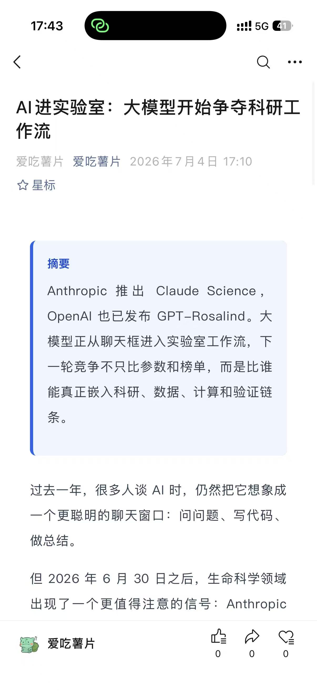

# article-wechat-auto

---

这是一个面向微信公众号 AI 资讯生产的 Codex Skill 仓库。它把「搜索最新 AI 资讯」「撰写公众号文章」「生成封面图」「转换微信可复制 HTML」「发布到公众号草稿箱」这几步拆成独立 skill，同时提供一个主入口 `article-wechat-auto` 来串联完整流程。

这套 skill 适合公众号编辑、独立作者、内容运营和排版岗使用。它可以帮助你从 OpenAI、Claude Code、Codex、Gemini、AI 工具和开发者生态等方向获取最新资讯，整理成适合公众号阅读的文章，并产出可人工审阅、可复制排版、可进入微信草稿箱的内容资产。

最终产出通常包括：

- 一篇结构化 Markdown 文稿
- 一张微信公众号封面图 `cover.jpg`
- 一个可在浏览器打开并复制到微信后台的 HTML 文件
- 可选：一个通过微信公众号 API 创建的草稿箱文章

---

## 目录结构

```text
.
├── README.md
├── article/
│   └── YYYY-MM-DD_N/
│       ├── *.md
│       ├── *-wechat.html
│       ├── cover-source.png
│       └── cover.jpg
└── skills/
    ├── article-wechat-auto/
    │   ├── SKILL.md
    │   └── scripts/
    │       └── run_workflow.py
    ├── article-search/
    │   ├── SKILL.md
    │   └── scripts/
    │       └── fetch_ai_news_rss.py
    ├── article-writing/
    │   ├── SKILL.md
    │   └── scripts/
    │       └── review_article_markdown.py
    ├── article-cover-image/
    │   ├── SKILL.md
    │   └── scripts/
    │       └── normalize_cover_image.py
    ├── article-format/
    │   ├── SKILL.md
    │   └── scripts/
    │       └── convert_markdown_to_wechat_html.py
    └── article-publish/
        ├── SKILL.md
        ├── wechat_publish_config.json
        └── scripts/
            └── publish_draft_wechat.py
```

各目录职责如下：

- `article-wechat-auto`：主入口，负责串联搜索、写作、封面、排版和发布流程。
- `article-search`：负责联网搜索、RSS 获取和最新 AI 资讯选题整理。
- `article-writing`：负责把单条资讯改写成适合公众号阅读的 Markdown 文稿。
- `article-cover-image`：负责生成并规范化微信公众号封面图。
- `article-format`：负责把 Markdown 转换成微信后台可复制的富文本 HTML。
- `article-publish`：负责读取微信配置、上传封面素材、创建公众号草稿。
- `article/`：存放每次生成的 Markdown、HTML、封面图和相关中间文件。

---

## 工作流程

完整流程由 `article-wechat-auto` 统一调度，默认顺序如下：

1. `article-search` 搜索和整理最新 AI 资讯，优先使用官方来源、RSS 和可信媒体。
2. 从资讯列表中选择最适合写成公众号文章的主题。
3. 在 `article/` 下创建本次文章目录，命名格式为 `YYYY-MM-DD_N`，例如 `2026-07-04_1`。
4. `article-writing` 根据选题撰写 Markdown 文稿，并检查摘要长度、正文结构、语病、错别字和过度推断。
5. `article-cover-image` 根据文章标题生成蓝色简约科技风封面，并规范化为 `900x383` 的 `cover.jpg`。
6. `article-format` 把 Markdown 转换为一个微信后台可复制的 HTML 页面，正文不会重复渲染文章 H1 标题。
7. 人工打开 HTML 页面，复制所见即所得内容到微信编辑器，或选择继续执行发布。
8. `article-publish` 通过微信公众号 API 上传封面并创建草稿箱文章，等待人工审阅。

每次生成内容都会放在独立文章目录中，避免多次运行互相覆盖。

---

## 使用方式

1、确认python环境：

脚本以 Python 为主，建议安装：

```bash
python -m pip install --upgrade pip
python -m pip install pillow pyyaml
```

其中 `pillow` 用于封面图裁切和压缩，`pyyaml` 用于 skill 文档校验。如果本机没有安装 `pillow`，封面规范化脚本会尝试使用系统中的 `ffmpeg` 或 Windows 图像能力作为降级方案。

2、最简单的方式是直接调用主 skill：

```text
$article-wechat-auto 发布一篇最新的 AI 资讯
```

3、如果只想执行某一个环节，也可以单独调用子 skill：

```text
$article-search 搜索最新 AI 资讯
$article-writing 把第一篇资讯整理成公众号 Markdown
$article-cover-image 为这篇文章生成封面图
$article-format 把 Markdown 转成微信可复制 HTML
$article-publish 发布到微信公众号草稿箱
```

4、发布到微信草稿箱前，需要先填写配置文件：

```text
skills/article-publish/wechat_publish_config.json
```

配置中主要包含微信公众号的 `appid`、`secret`、作者信息、评论设置等。封面图会由流程自动生成并上传为微信永久素材，再把返回的 `media_id` 写入草稿创建请求。

---

## 生成效果



---

## 后续改进方向

后续可以继续增强这些能力：

- 增加更多 AI 资讯源，例如官方博客、GitHub Release、模型评测站和开发者社区 RSS。
- 为选题增加打分机制，从时效性、受众价值、可信度和可写性自动推荐主选题。
- 增加多套公众号排版主题，例如科技蓝、极简黑白、深度分析、工具清单等。
- 增加封面图人工复核辅助，自动检查文字是否可读、尺寸是否合规、主体是否清晰。
- 增加草稿发布前检查清单，例如标题长度、摘要长度、封面素材、正文空段、敏感词和链接可访问性。
- 支持把生成结果同步到知识库、Notion、飞书文档或 Git 仓库，方便长期内容归档。
